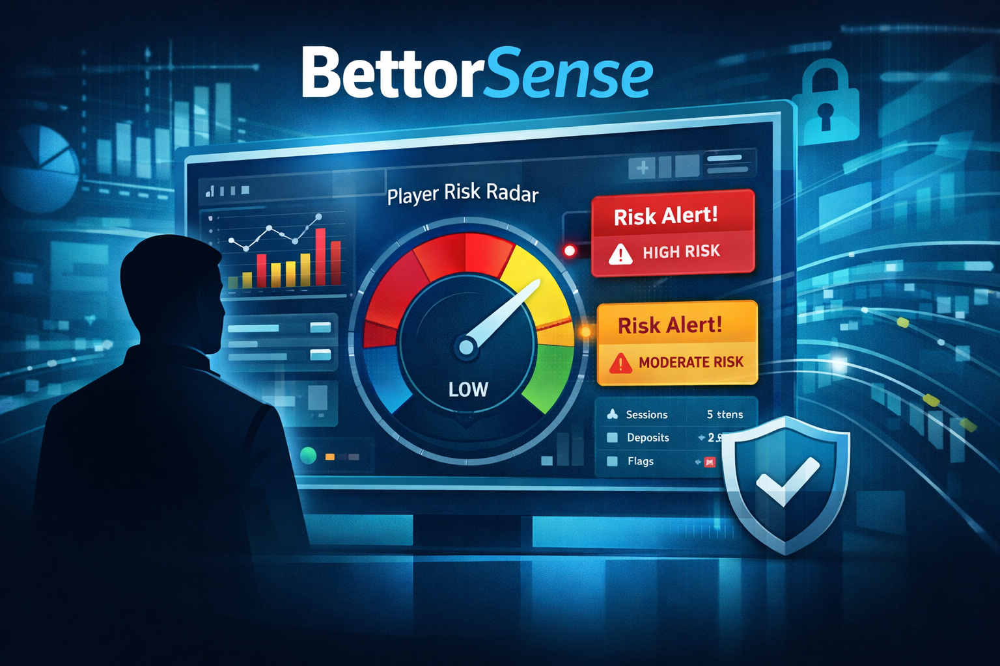
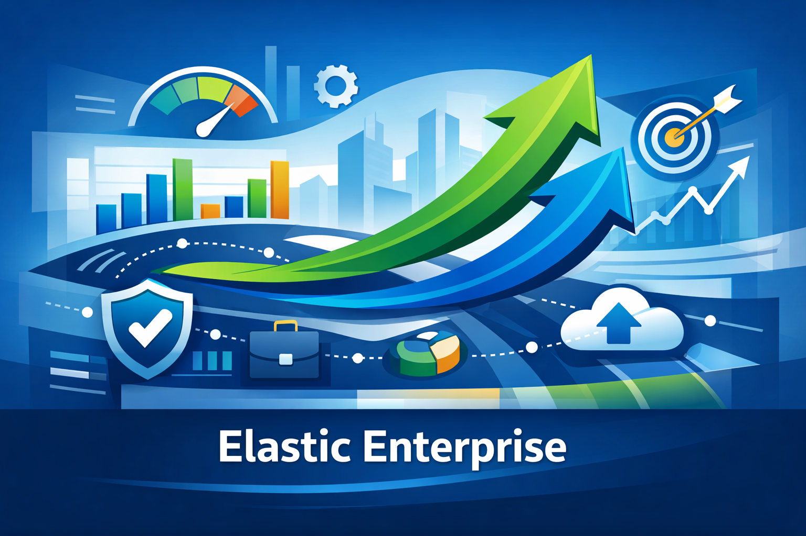
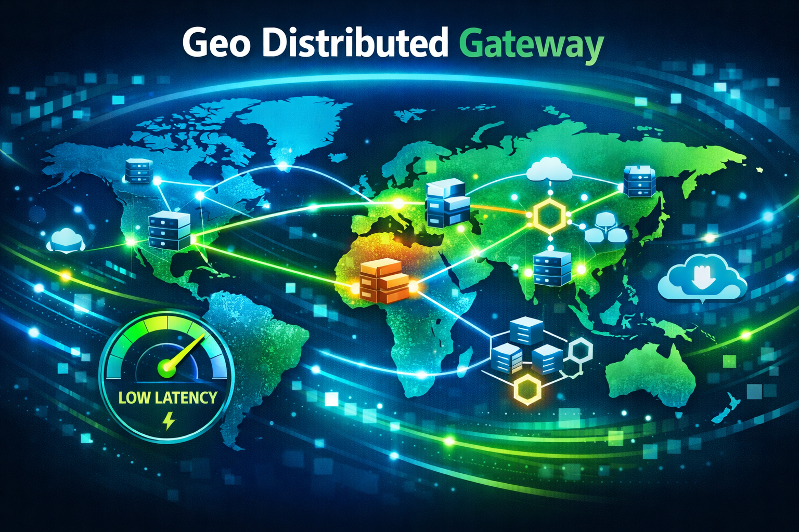
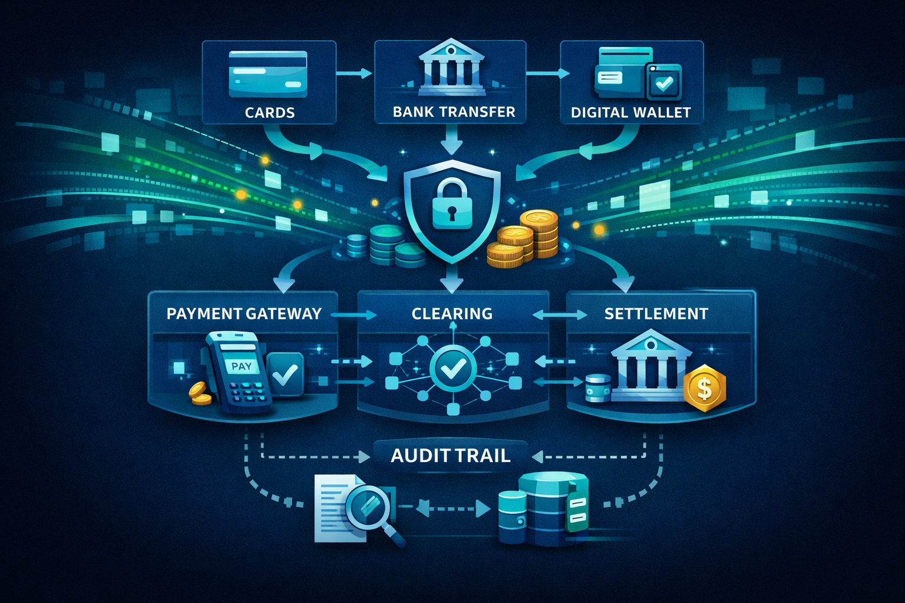
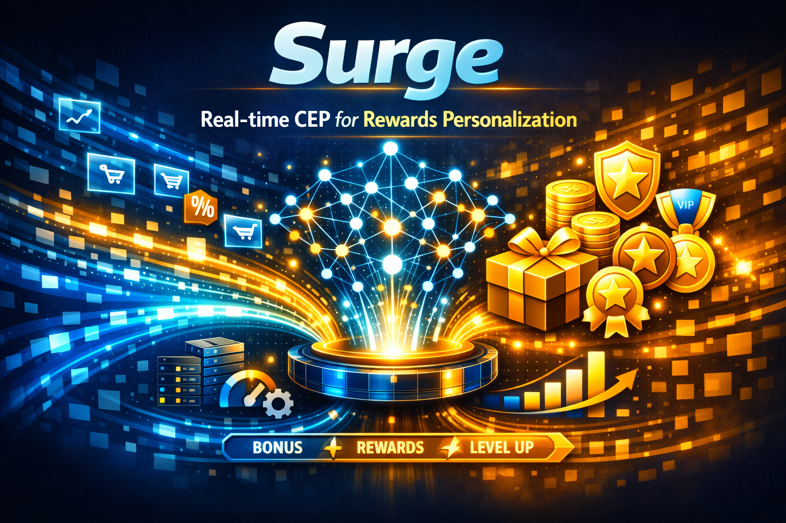
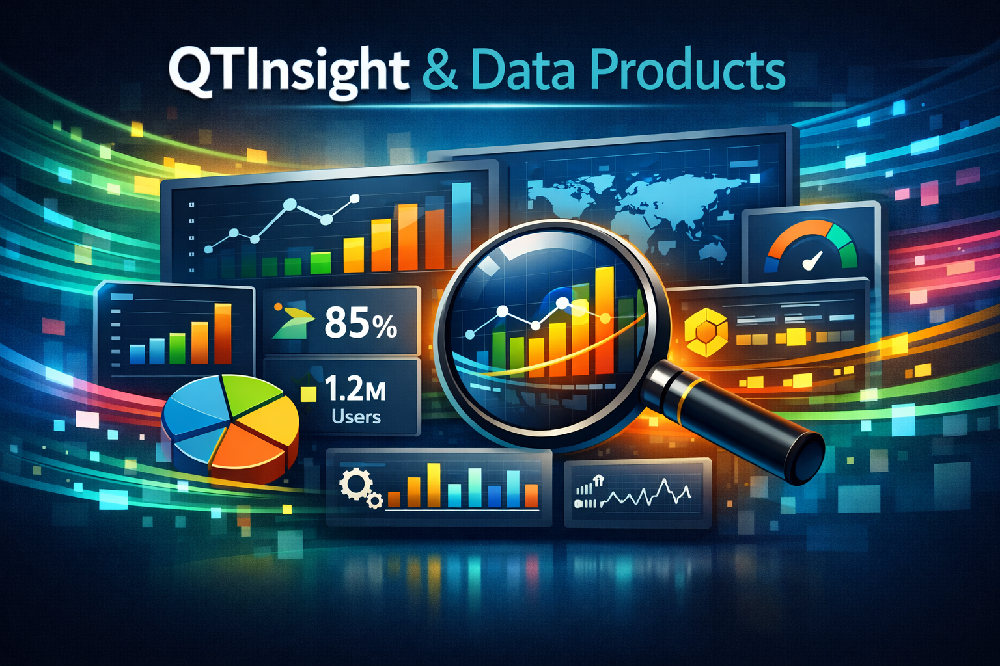
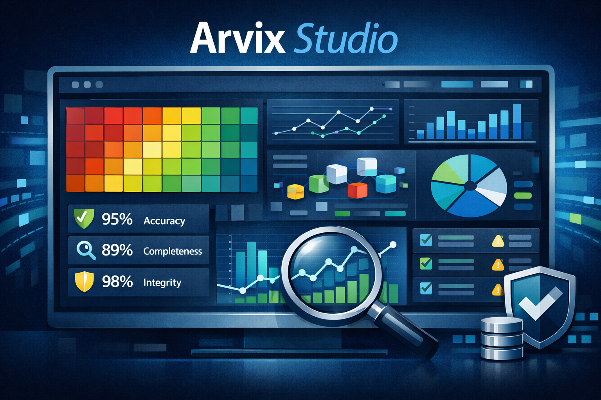

# Jean-Pierre Vermeulen

**Senior Staff Engineer · Head of Engineering · Enterprise Architect**

vermeulen.jp@outlook.com | +27 71 410 9633 | Melkbosstrand, South Africa

[linkedin.com/in/vermeulenjp/](https://www.linkedin.com/in/vermeulenjp/)

---

## Executive Summary

Engineer & Architect with 28+ years of experience designing, building and leading the delivery of 30+ cloud-native, high-availability platforms that process petabyte-scale data and billions of monthly transactions. Combines deep technical expertise with strategic enterprise architecture thinking — applying TOGAF, ArchiMate and AI-enabled patterns — to deliver scalable, compliant roadmaps, capacity and cost planning, and measurable business outcomes.

Track record of leading engineering organisations at NYSE and NASDAQ-listed global technology companies, including Sportradar (NASDAQ: SRAD) and SGHC (NYSE: SGHC), where he managed distributed teams across multiple continents and delivered platforms serving millions of customers in 120+ markets. Expertise spans the full technology stack from event-driven microservices and complex event processing through to cloud infrastructure and AI agentic patterns.

Specialist in iGaming, financial and regulatory technology with demonstrated success architecting and launching AI-powered platforms (BettorSense, Managed Rewards) that combine responsible gaming, real-time personalisation and multi-jurisdictional compliance. Deep experience in enterprise architecture transformation, having led cloud adoption programmes, defined target operating models and established architecture practices for organisations with 500+ technology staff.

Technical proficiency spans C#, Java, Python, Node.js, .NET, Akka.Net, Kubernetes, Docker, Azure, AWS, PostgreSQL, MongoDB, Kafka, RabbitMQ, Elasticsearch and a broad range of AI/LLM tooling including agentic development patterns, prompt engineering, MCP servers and vector databases.

Transformational leader who builds high-performing engineering cultures through mentoring, architecture-as-code practices, design pattern adoption and engineering guardrails that raise delivery quality, resilience and velocity.

---

## Career Narrative

My career follows a deliberate pattern: I am brought into organisations to establish or transform engineering capabilities — building teams, defining architecture, instituting governance — then transition into senior technical roles where I contribute hands-on while the teams I built operate autonomously. This movement between Head of Engineering/Architecture and Staff Engineer/IC tracks reflects my strength as a **practitioner-leader**: someone who can both architect the vision and write the code to prove it. Each management phase (SGHC, Sportradar) was followed by an IC/technical phase within the same organisation, ensuring continuity and demonstrating that leadership and technical contribution are complementary, not sequential. Proven track record within SOC2 and SOX404 compliance frameworks at NASDAQ-listed Sportradar and NYSE-listed SGHC.

---

## Areas of Expertise

| Category | Skills |
|---|---|
| AI & Machine Learning | AI Leadership, AI-Driven Solutions, Machine Learning Projects, Prompt Engineering, LLMs, Cursor AI, AI Agentic Workflows, Agentic Development Life Cycle, AI Regulatory Tooling, n8n, MCP Servers, Port.IO, GitHub Copilot |
| Enterprise Architecture & Governance | Enterprise Architecture, TOGAF, ArchiMate, TIME Framework, Target Operating Models, Enterprise Governance, Architecture-as-Code, Architecture Governance, Clean Architecture, Solution Architecture |
| Engineering Leadership & Strategy | Engineering Leadership, Transformational Leadership, Coaching & Mentoring, Team Building, Innovation Leadership, Technical Strategy & Roadmaps, Vendor & Stakeholder Management, DevOps Leadership, Strategic Thinking, Agile Delivery, ALM, Organizational Transformation |
| Cloud, Infrastructure & DevOps | Cloud Computing, AWS, Azure, ECS, ECR, API Gateway, Docker, Podman, Kubernetes, ArgoCD, Terraform, Linux, CI/CD Pipelines, Git, GitLab, Infrastructure Automation, Capacity & Cost Planning |
| Programming Languages | C#, Java, Python, Go, Node.js, JavaScript, TypeScript, jQuery, Scala, PHP, SQL |
| Frameworks | Next.js, .NET, gRPC, protoBuf, Akka, Apache Pekko, NEsper, EsperTech |
| Databases, Analytics & CEP | PostgreSQL, MongoDB, MySQL, SQL Server, RedShift, Neo4j, ELK Stack, PowerBI, Analytics Platforms, Complex Event Processing (CEP), Real-Time Analytics |
| Messaging, Streaming & Distributed Systems | Distributed Computing, Reactive Architecture, Akka.Net, RabbitMQ, Kafka (MSK), EventStoreDB, Event-Driven Architecture, Microservices, REST APIs, gRPC, protoBuf, High-Availability Systems, Low-Latency Systems |
| Domain Expertise | iGaming Platforms, Betting Platforms, Responsible Gaming Systems, Regulatory Platforms, Financial Systems, ERP & Supply Chain Systems, Warehouse Management Systems, SaaS Platforms, Mobile-First Platform Design, SOC2 Compliance, SOX404 Compliance |
| Methods & Practices | Agile Methodology, Proof of Concepts (POCs), Technical Discovery, Performance Optimization, System Modernization, Scalability Engineering, API Design, API Integrations, Integration Architecture, Cross-Functional Collaboration, Problem Solving, Mutation Testing, GitBook, Stakeholder Communication |

---

## Professional Experience

### Sportradar Group (incl. BetTech) — Apr 2023 – Present

**NASDAQ-listed (NASDAQ: SRAD)** global sports technology company headquartered in Switzerland, employing over 3,000 people across 30+ offices worldwide. Processes real-time data for over 120 sports and serves 100+ operator clients across 120+ markets.

**Roles:** Head of Engineering & Architecture (BetTech) → Head of Engineering → Senior Staff Engineer

- Defined architectural strategy and governance for core real-time betting platforms (Managed Betting Services, Rewards, Regulatory Services) ensuring low-latency performance, regulatory compliance and operational scale across 120+ markets
- Owned multi-year technology roadmaps, capacity and cost planning, and vendor strategy for global peak-event scaling
- Architected and launched [**BettorSense**](#2-bettorsense---ai-driven-responsible-gaming-platform) — an AI-powered player-protection platform for proactive risk detection and personalised interventions
- Designed [**Managed Rewards**](#1-managed-rewards---agentic-pam--campaign-platform) — a real-time agentic PAM platform integrating bonuses, AI campaigns and event-linked mechanics (SuperSub, VAR, N-UP, BetBoost)
- Built and mentored distributed engineering teams, instituting architecture-as-code practices, design patterns and guardrails
- Drove event-driven architecture, CEP and real-time analytics for sub-second in-play betting latency
- Ensured SOC2 compliance at NASDAQ-listed Sportradar, embedding audit controls and security governance
- Delivered technical discovery and POCs to de-risk initiatives and translate product requirements into executable designs
- Applied AI solutions and agentic development patterns to accelerate delivery and expand feature capabilities

**Tech Stack:** C#, .NET Core, Azure, Kubernetes, Docker, Kafka (MSK), PostgreSQL, MongoDB, ArgoCD, Terraform, LLMs, Agentic AI Patterns, MCP, Event-Driven Architecture

---

### SGHC (Super Group Holding Company) — BetWay, Spin — Jan 2010 – Apr 2023

**NYSE: SGHC** — global online gaming operator employing over 4,500 staff across 30+ markets. Operates the BetWay and Spin brands, serving millions of active customers with sports betting, casino, poker and esports products. Through Win Technologies Ltd (London) and Digital Outsource Services (Cape Town), manages over 500 technology staff and processes billions of transactions annually.

**Roles:** Senior Developer → Team Lead (Forwardslash) → Solutions Architect → Enterprise Architect → Head of Architecture → Head of Architecture (Win Technologies Ltd, London)

- Organised enterprise architecture across 500+ technology staff serving 30+ markets; built governance frameworks, centre of excellence and Architecture Academy
- Established and scaled enterprise architecture practice at Win Technologies, driving strategic alignment across London and Cape Town teams
- Designed [**Surge**](#12-surge---real-time-cep--personalization) — real-time event-driven platform incorporating CEP to unify business strategy with intelligent processing
- Architected [**Project TAP**](#9-project-tap---reactive-microservices-payments-platform) — reactive microservices payment platform handling millions of euros monthly via the Actor Model
- Delivered [**Cloud Adoption Programme**](#4-cloud-adoption-programme--datax) (Microsoft CAF + Open Alliance) defining transformation roadmap and workload assessments
- Led [**DataX**](#4-cloud-adoption-programme--datax) modern data warehouse programme collaborating with Microsoft on scalable cloud reference architecture
- Launched [**Information Builder**](#6-information-builder---gamified-data-governance) — gamified data governance programme to increase data asset value
- Built [**LogMarshal**](#10-logmarshal---centralised-log-streaming--analytics) — centralised log streaming and analytics using RabbitMQ, Elasticsearch and Akka.Net
- Architected [**C3**](#14-c3---high-volume-communication-platform) bulk communication platform handling 30–40M SMS and 200–400M emails monthly
- Ensured SOX404 compliance at NYSE-listed SGHC, embedding audit controls and financial governance
- Founded the Architecture Academy to train the technology community on patterns, practices and governance
- Used gamification and engagement techniques to increase adoption of architecture practices

**Tech Stack:** C#, .NET Framework/Core, Akka.Net, RabbitMQ, Kafka, Elasticsearch, Kibana, SQL Server, MongoDB, Neo4j, Azure, Docker, EventStoreDB, NEsper, Event-Driven Architecture, Microservices, CEP, REST APIs, WPF, TPL Dataflow

---

### Vaxowave (Contractor — Old Mutual Africa) — 2023

Enterprise architecture contractor for Old Mutual Africa, one of Africa's largest financial services groups operating across nine countries.

**Role:** Enterprise Architect (Contractor)

- Defined baseline enterprise architecture for Old Mutual Africa across nine countries, increasing IT estate visibility and coherence
- Applied TIME (Tolerate, Invest, Migrate, Eliminate) categorisation to reduce technical debt and clarify migration paths
- Developed future enterprise architecture and target states aligned to strategic goals
- Engaged stakeholders to embed architecture principles and reduce delivery friction across business units

**Tech Stack:** TOGAF 9.1, ArchiMate, TIME Framework

---

### DataScope WMS (Contractor) — 2023

South African warehouse management and supply chain software provider serving clients across Africa and Europe.

**Role:** Senior Software Engineer (Contractor)

- Extended the WMS platform with new services using C# and .NET, improving functionality and maintainability
- Modernised system architecture to increase performance and reduce technical debt
- Coached junior developers on clean architecture, automated testing and CI/CD best practices
- Introduced Agile workflows and tooling to streamline project delivery

**Tech Stack:** C#, .NET, SQL Server, Clean Architecture, CI/CD, Agile

---

### Money Supermarket — Mar 2008 – Dec 2009

**LSE: MONY** — UK-based FTSE 250 price comparison website serving millions of customers monthly across insurance, money, travel and utilities verticals.

**Roles:** Lead Analyst Programmer → Team Lead → Technical Lead (Money Vertical)

- Directed technical strategy for the Money Vertical, enhancing operational efficiency and competitive positioning
- Mentored developers on clean architecture, SOA and software design
- Designed clean architecture standards, optimising performance, scalability and maintainability
- Oversaw deployment of over 32 systems, contributing to international business growth
- Led high-volume transaction web applications with POC-driven iterative delivery

**Tech Stack:** C#, .NET, SQL Server, SOA, Agile, TDD, Clean Architecture

---

### Business Connexion (BCX) — Mar 2008

Leading South African ICT services provider delivering technology solutions and consulting to enterprise clients across Africa and internationally.

**Role:** Consultant (seconded to Money Supermarket, UK)

- Led software engineering projects for clients through BCX, including UK secondment
- Mentored junior developers in software design and architecture principles

**Tech Stack:** C#, .NET, SQL Server

---

### Datascope Consultants — Feb 2006 – Feb 2008

South African IT consulting firm specialising in enterprise software, supply chain systems and warehouse management. Its flagship WMS product achieved international deployment.

**Role:** Senior Software Engineer

- Developed SYSPRO ERP integration systems and supply chain solutions
- Founded and managed global deployment of the Warehouse Management System (WMS)
- Designed line hauling products for motor manufacturing with vehicle tracking and warehouse monitoring
- Mentored junior developers in clean architecture and agile methodologies

**Tech Stack:** C#, .NET, SQL Server, SYSPRO ERP e.Net Services, WMS, Supply Chain Integration

---

### Arvix (Netherlands) — Mar 2005 – Mar 2006

Netherlands-based data quality company providing profiling, analysis and cleansing solutions to ABN-AMRO, PGM and Rabobank.

**Role:** Senior Software Developer

- Led development of data quality products using complex algorithms and data analysis
- Collaborated with mathematicians on visualisation frameworks for enterprise data quality
- Mentored junior engineers, fostering continuous learning and technical excellence
- Analysed data quality issues providing actionable insights to major financial institutions

**Tech Stack:** .NET, C#, SQL Server, Data Quality, Data Analysis, Windows Forms

---

### Blue Star Consultants (Utrecht, Netherlands) — Jan 2000 – Jan 2005

Netherlands-based IT consultancy delivering custom solutions to financial, e-commerce, engineering and medical sectors across Europe.

**Role:** Senior Software Engineer

- Managed diverse consultancy projects across Europe through full SDLC
- Built BestDeal e-commerce platform — one of the first large-scale .NET C# projects, still in production
- Developed Visual Alert — Honeywell Galaxy security panel integration via C++/.NET with MSMQ
- Built Arvix Studio — data quality visualisation framework for ABN-AMRO, PGM and Rabobank
- Mentored development staff across modern software practices

**Tech Stack:** .NET, C#, SQL Server, MSMQ, Windows Forms, Web Applications, .NET 1.0–2.0

---

### Sanlam — Jan 1998 – Aug 2000

One of South Africa's largest financial services groups (JSE: SLM).

**Role:** Analyst Software Developer

- Developed internal systems for application forms and document workflows at Sanlam Unit Trust
- Enhanced system performance and scalability through code optimisation
- Conducted testing and validation ensuring quality and financial regulatory compliance
- Gained foundational experience in financial services and enterprise software development

**Tech Stack:** .NET, C#, SQL Server, Financial Systems

---

## Project Portfolio

---

#### 1. Managed Rewards — Agentic PAM & Campaign Platform

| | |
|---|---|
| **Company** | Sportradar |
| **Role / Period** | Architect and Technical Lead — Jan 2025 – Present |
| **Tech Stack** | Kubernetes, ArgoCD, Terraform, Microservices, Vector DB, LLMs |

**Challenge:** Create a rewards engine that supports real-time campaign activation, personalised bonuses, and event-linked mechanics across multiple markets.

**Approach:** Built the platform with agentic decisioning, modular campaign services, and a vectorized personalization layer for dynamic offer selection. Integrated traditional rewards, modern AI campaigns, and event-linked mechanics (SuperSub, VAR, N-UP, BetBoost).

**Outcome:** Delivered a scalable PAM engine that supports rapid campaign iteration, improves player engagement, and simplifies reward management across 120+ markets.

**Description:**
Designed an adaptive rewards ecosystem that connects customer events to intelligent campaign decisions, enabling promotional agility at scale while maintaining consistency across markets.

---

#### 2. BettorSense — AI-Driven Responsible Gaming Platform

| | |
|---|---|
| **Company** | Sportradar |
| **Role / Period** | Lead Architect / Senior Staff Engineer — Jan 2024 – Present |
| **Tech Stack** | C#, .NET Core, Kubernetes, Kafka, PostgreSQL, LLM Integrations |

**Challenge:** Build a production-ready responsible gaming system that detects risk in real time and triggers personalised interventions without impacting customer experience.

**Approach:** Designed an event-driven pipeline with CEP rules, real-time telemetry, and LLM-powered risk scoring. Integrated the solution with existing betting platform workflows and compliance controls.

**Outcome:** Enabled proactive player protection, reduced regulatory risk, and improved the ability to deliver personalised, safe recommendations across multiple jurisdictions.

**Description:**
Delivered a production-ready platform that continuously monitors player behaviour, scores risk in sub-second windows, and activates compliance-safe interventions using AI. The design balances real-time performance with auditability and regulator-ready reporting.

---

#### 3. Central Regulatory Platform — Multi-Region Compliance

| | |
|---|---|
| **Company** | Sportradar |
| **Role / Period** | Architect / Senior Staff Engineer — Aug 2023 – Present |
| **Tech Stack** | C#, .NET, Azure, Kafka, PostgreSQL, Audit Trails |

**Challenge:** Create a centralised regulatory management platform to enforce and monitor multi-jurisdictional compliance across betting products.

**Approach:** Designed a policy-driven rules engine, audit trails, and event-based reporting pipelines with role-based access and regulator interfaces.

**Outcome:** Reduced manual compliance effort, improved auditability and delivery speed for regulation changes across 120+ markets.

**Description:**
Built a regulatory backbone that centralises controls, reporting and alerting for multinational iGaming operations, enabling rapid adaptation to changing jurisdictional rules.

---

#### 4. Cloud Adoption Programme / DataX

| | |
|---|---|
| **Company** | Digital Outsource Services |
| **Role / Period** | Enterprise Architect — Jan 2021 – 2023 |
| **Tech Stack** | Azure, Terraform, RedShift / Databricks patterns, Analytics |

**Challenge:** Define an enterprise cloud strategy and modern data architecture for a global organisation with complex compliance requirements.

**Approach:** Led assessment workshops, mapped application and data workloads, and produced a cloud migration roadmap aligned to business outcomes. Collaborated with Microsoft on scalable cloud reference architecture.

**Outcome:** Created a practical transformation plan with cost and capacity guidance, target architecture, and measurable milestones for migration and analytics.

**Description:**
Translated business goals into a phased cloud adoption plan, defining migration paths, security guardrails, and modern analytics architecture to support enterprise reporting and regulatory reporting.

---

#### 5. Polarity Platform — Sovereign Identity Prototype

| | |
|---|---|
| **Company** | Digital Outsource Services |
| **Role / Period** | Architect — Jun 2019 – Feb 2020 |
| **Tech Stack** | Azure, Blockchain, Verifiable Credentials |

**Challenge:** Prototype an Azure/Blockchain sovereign digital identity platform for trusted voting and identity verification.

**Approach:** Built a privacy-preserving identity fabric using blockchain anchors, verifiable credentials and a lightweight UX for citizens.

**Outcome:** Proof-of-concept demonstrating secure, auditable identity workflows for public-sector stakeholders.

**Description:**
Proved viability of a decentralized identity approach for trusted public workflows with strong auditability.

---

#### 6. Information Builder — Gamified Data Governance

| | |
|---|---|
| **Company** | Digital Outsource Services |
| **Role / Period** | Lead Architect — Aug 2018 – Sep 2019 |
| **Tech Stack** | .NET, SQL Server, Web UI |

**Challenge:** Increase data asset value by improving data governance adoption across the organisation.

**Approach:** Gamified governance platform combining data catalog, micro-training and reward mechanics to incentivise stewardship.

**Outcome:** Increased data ownership, higher catalog coverage and measurable improvements in data quality.

**Description:**
Implemented a lightweight governance layer that drove measurable engagement through game mechanics and clear incentives.

---

#### 7. Elastic Enterprise — Target-State Transformation

| | |
|---|---|
| **Company** | Digital Outsource Services |
| **Role / Period** | Enterprise Architect — Jun 2018 – Jan 2021 |
| **Tech Stack** | Azure, Terraform, CI/CD, Observability |

**Challenge:** Define a target-state architecture focused on DORA metrics and operational excellence.

**Approach:** Conducted capability mapping, gap analysis, and DORA-aligned measurement frameworks; designed target architecture and implementation roadmap.

**Outcome:** Clear transformation milestones, actionable DORA improvements and reduced delivery friction across engineering teams.

**Description:**
Delivered a practical transformation blueprint aligning architecture, tooling and metrics to measurable delivery outcomes.

---

#### 8. Geo Distributed Gateway & Microservices

| | |
|---|---|
| **Company** | Digital Outsource Services |
| **Role / Period** | Architect — Nov 2016 – Feb 2017 |
| **Tech Stack** | Kubernetes, Service Mesh, gRPC |

**Challenge:** Create a geo-distributed gateway for portable enterprise services across regions.

**Approach:** Built resilient gateway patterns, data partitioning strategies and service mesh-enabled routing for low-latency global access.

**Outcome:** Improved local performance, fault isolation and simplified multi-region deployments.

**Description:**
Architected a gateway fabric enabling consistent service contracts and performant regional access across distributed enterprise services.

---

#### 9. Project TAP — Reactive Microservices Payments Platform

| | |
|---|---|
| **Company** | Digital Outsource Services |
| **Role / Period** | Solutions Architect — Sep 2016 – Apr 2017 |
| **Tech Stack** | Akka.Net, Event Sourcing, C# |

**Challenge:** Build a payment orchestration system handling multiple payment rails with resilience and auditability.

**Approach:** Applied actor-model design with Akka.Net and event-driven integration; added replayable audit logs and monitoring.

**Outcome:** High-throughput payments orchestration with simplified onboarding for new payment rails, handling millions in monthly transactions.

**Description:**
Architected a fault-tolerant payments fabric decoupling orchestration from settlement, enabling rapid onboarding of new rails while preserving transactional consistency and operational visibility.

---

#### 10. LogMarshal — Centralised Log Streaming & Analytics

| | |
|---|---|
| **Company** | Digital Outsource Services |
| **Role / Period** | Architect — Feb 2016 – 2023 |
| **Tech Stack** | RabbitMQ, Elasticsearch, Akka.Net, Log Enrichment |

**Challenge:** Centralise logging and provide enterprise-grade log streaming, indexing and analytics across fragmented systems.

**Approach:** Designed a scalable log ingestion pipeline using RabbitMQ for reliable transport, Elasticsearch for indexing and Akka.Net workers for enrichment and routing; included alerting, retention policies and queryable audit trails.

**Outcome:** Improved incident detection, reduced mean time to resolution, and provided searchable, regulator-ready logs for audit and compliance.

**Description:**
Built a production-ready logging platform that supported high-throughput ingestion, searchable analytics and integration with real-time processing engines.

---

#### 11. The Vault — Secure Distributed Data Vault

| | |
|---|---|
| **Company** | Digital Outsource Services |
| **Role / Period** | Solution Architect — Feb 2016 – Jan 2018 |
| **Tech Stack** | C#, .NET, Azure Key Vault, RabbitMQ, PostgreSQL |

**Challenge:** Build a secure distributed vault platform for sensitive data governance and compliance.

**Approach:** Designed encrypted vault services, key management integration and secure audit trails across microservices.

**Outcome:** Stronger data control, simplified compliance reporting, and centralized policy enforcement.

**Description:**
Delivered a production-grade vault that balanced security, scalability and regulator-ready reporting.

---

#### 12. Surge — Real-Time CEP & Personalization

| | |
|---|---|
| **Company** | Digital Outsource Services |
| **Role / Period** | Architect — Jan 2015 – 2023 (incl. Surge R3) |
| **Tech Stack** | Akka.Net, CEP, RabbitMQ, Real-Time Telemetry |

**Challenge:** Build a horizontally scalable CEP cluster for realtime analytics and personalised offer progression.

**Approach:** Implemented an Akka.Net processing cluster for CEP, integrating telemetry streams and event-driven rules to power sub-second bonus and rewards progression for personalised offers.

**Outcome:** Enabled personalised, event-driven reward mechanics, reduced operational response time and improved business conversion from realtime interactions.

**Description:**
Delivered a CEP-first platform that converts streaming events into real-time personalised reward decisions and orchestration.

---

#### 13. QTInsight & Data Products

| | |
|---|---|
| **Company** | Digital Outsource Services |
| **Role / Period** | Architect / Data Lead — Nov 2014 – Feb 2015 |
| **Tech Stack** | ELK Stack, PowerBI, Kafka |

**Challenge:** Build analytics products to surface operational and business insights from streaming data.

**Approach:** Designed data pipelines, OLAP models and dashboards for near-real-time insight delivery.

**Outcome:** Faster decision-making, better operational monitoring and product analytics.

**Description:**
Delivered analytics products that turned streaming telemetry into actionable business signals, including QTInsight (dynamic workflow CEP on QueueTransit Runtime Platform) and QTCEP (global federated CEP with stream-based enterprise data warehousing).

---

#### 14. C3 — High-Volume Communication Platform

| | |
|---|---|
| **Company** | Digital Outsource Services |
| **Role / Period** | Architect — Mar 2010 – 2023 |
| **Tech Stack** | RabbitMQ, Elasticsearch, .NET |

**Challenge:** Deliver a templated platform to send 30–40M SMS and 200–400M emails monthly.

**Approach:** Implemented scalable queuing, templating, throttling and analytics in a distributed architecture.

**Outcome:** Reliable, high-throughput communication service with monitoring and fault tolerance.

**Description:**
Built a templated bulk communication platform with strong throughput and operational controls, horizontally scalable and web-based.

---

#### 15. Warehouse Management Systems & SYSPRO Integrations

| | |
|---|---|
| **Company** | Datascope Consultants |
| **Role / Period** | Senior Software Engineer — Feb 2006 – Feb 2008 |
| **Tech Stack** | C#, .NET, SYSPRO e.Net Services |

**Challenge:** Develop WMS solutions and integrate with SYSPRO ERP for logistics automation.

**Approach:** Built scanning, tracking and integration modules; optimised inventory flows and interfaces.

**Outcome:** Deployed WMS internationally and improved supply chain visibility for clients across Africa and Europe.

**Description:**
Built and deployed warehouse management products that improved operational efficiency and tracing, including the global deployment of the WMS platform and the Bullet supply chain management system.

---

#### 16. Arvix Studio — Data Quality Visualisation

| | |
|---|---|
| **Company** | Arvix |
| **Role / Period** | Senior Software Developer — Jan 2002 – 2003 |
| **Tech Stack** | .NET, C#, Data Profiling, Visualization |

**Challenge:** Provide enterprise data profiling and cleansing visualisations for major banks.

**Approach:** Built interactive visualisation tools and profiling algorithms for data quality insights.

**Outcome:** Enabled clients to identify and remediate data quality problems quickly, serving ABN-AMRO, PGM and Rabobank.

**Description:**
Led development of data quality tools used by top-tier financial institutions, creating a data quality visualisation framework that combined algorithmic depth with enterprise reporting.

---

#### 17. BestDeal — Early E-Commerce Platform

| | |
|---|---|
| **Company** | BestDeal.nl |
| **Role / Period** | Senior Software Engineer — Jan 2000 – 2005 |
| **Tech Stack** | .NET, C#, SQL Server, Web Services |

**Challenge:** Build an early large-scale .NET e-commerce platform still in production.

**Approach:** Designed modular web services, data models and robust shopping flows for scale.

**Outcome:** Long-lived production platform supporting sustained traffic and growth across thousands of customers.

**Description:**
Developed a durable e-commerce platform with long-term operational success — one of the first large-scale .NET C# e-commerce projects.

---

## Education

| Period | Institution | Qualification |
|---|---|---|
| 1994 – 2000 | University of Port Elizabeth (NMMU) | Honours Degree in Computer Science — algorithms, software engineering and systems design |
| 1999 – 2002 | University of Port Elizabeth (NMMU) | Honours Degree in Physics — inorganic materials, crystallography and quantum mechanics |
| 1989 – 1993 | Werda High, Durban | Matric — Mathematics, Science, Accounting, Engineering Drawing, Music |

---

## Certifications

| Certification | Institution | Period |
|---|---|---|
| TOGAF 9.1 | Simplilearn | Feb 2017 – Apr 2017 |
| Functional Programming Principles in Scala | École Polytechnique Fédérale de Lausanne | Sept 2012 – Nov 2012 |

---

## Languages

- **Afrikaans** — Native
- **English** — Fluent
- **Dutch** — Conversational

---

## Personal

**Hobbies:** Padel, Hiking, Tennis, Skiing, Music, Art and Architecture, Good food and wine, Travelling and exploring the world.

**Freelance & Community:** As an architect, I maintain hands-on development skills through small freelance projects and short-term startup engagements (2016–2020). This keeps my technical edge sharp while allowing me to contribute to entrepreneurial ventures.

---

## Contact

- **Email:** vermeulen.jp@outlook.com
- **Phone:** +27 71 410 9633
- **LinkedIn:** [linkedin.com/in/vermeulenjp/](https://www.linkedin.com/in/vermeulenjp/)
- **Location:** Melkbosstrand, South Africa

Available for full-time employment. Also open to contract engagements — engineering, technical, hands-on, architectural, and leadership — from short-term sprints to multi-month programmes. Remote and hybrid.
